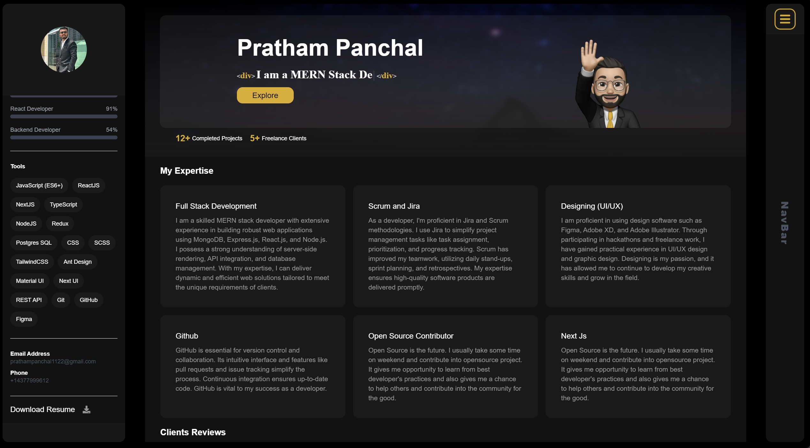

  

   
   
  
  

  <h2 align="center">Pratham Panchal - Personal portfolio</h2>

This website is fully responsive personal portfolio,  Responsive for all devices, built using Nextjs, TailwindCSS only.

<a href="https://pratham-panchal.netlify.app/"><strong>➥ Live Demo</strong></a>

 

### Demo Screeshots

### Prerequisites

Before you begin, ensure you have met the following requirements:

- [Git](https://git-scm.com/downloads "Download Git") must be installed on your operating system.

### Run Locally

To run **portfolio** locally, run this command on your git bash:

### Contact

If you want to contact with me you can reach me.

### License

This project is **free to use** and does not contains any license.
